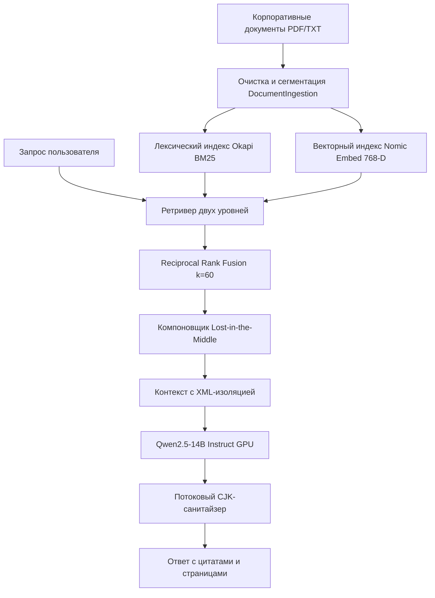

# Корпоративный комплекс Enterprise RAG 2.0
## Паспорт продукта и руководство по промышленной эксплуатации

---

## 1. Исполнительное резюме (Executive Summary)

**Enterprise RAG 2.0** — это автономная корпоративная вопросно-ответная система (Retrieval-Augmented Generation), разработанная для защищенной работы со служебной документацией, регламентами, нормативными актами и внутренними положениями организации.

### Ключевая ценность для организации:
1. **100% Конфиденциальность (Air-Gapped / On-Premises):**
   Все вычисления (семантические эмбеддинги и инференс языковой модели) производятся исключительно на локальных вычислительных мощностях организации. Ни один байт информации не покидает защищенный периметр и не передается сторонним облачным провайдерам.
2. **Двухуровневый гибридный поиск (Hybrid Retrieval):**
   Сочетание статистического алгоритма **Okapi BM25** и векторного семантического пространства **Nomic Embed Text v1.5 (768 измерений)** с алгоритмом слияния рангов **Reciprocal Rank Fusion (RRF k=60)** гарантирует нахождение как концептуальных смыслов, так и точных номеров приказов, дат и артикулов.
3. **Защита от галлюцинаций (Zero-Retrieval Threshold):**
   Система калибрована порогом уверенности: при отсутствии подтверждающих первоисточников модель прямо заявляет об отсутствии данных, а не выдумывает ложные сведения.
4. **Подтверждающие первоисточники со страницами:**
   Каждое утверждение сопровождается ссылкой на конкретный файл документа и страницу в оригинальном PDF.
5. **Двойной режим эксплуатации:**
   - **Автономный режим**: Запуск локального сервера и моделей в GPU в 1 клик без терминала.
   - **Клиентский режим**: Легковесное подключение к любому сетевому серверу через URL.

---

## 2. Архитектура системы

### 2.1. Конвейер индексации (Ingestion Pipeline)
- **Извлечение текста:** Поддержка сложных версток, таблиц, двухколоночных документов и сканов без искажения нумерации страниц.
- **Интеллектуальная очистка:** Удаление артефактов переносов слов, колонтитулов и дублирующихся пробелов.
- **Окно фрагментации (Chunking):** Размер фрагмента 800 символов с перекрытием 150 символов для сохранения семантической целостности предложений.

### 2.2. Поисковый движок (Hybrid Retriever)
- **Okapi BM25:** Русскоязычный стемминг (Snowball) с параметрами $k_1=1.5, b=0.75$.
- **Dense Vector Store:** 768-мерное косинусное пространство Nomic Embed Text v1.5.
- **Reciprocal Rank Fusion:**
  $$RRF\_Score(d) = \frac{1}{60 + Rank_{BM25}(d)} + \frac{1}{60 + Rank_{Dense}(d)}$$

### 2.3. Контекстный компоновщик (Lost-in-the-Middle Mitigation)
Исследования когнитивной механики трансформеров показывают U-образную деградацию внимания: модели с высокой вероятностью игнорируют факты, расположенные в середине длинного контекста.
Контекстный компоновщик производит переупорядочивание:
- Позиция 1: Топ-1 релевантный документ (начало контекста)
- Позиция N: Топ-2 релевантный документ (конец контекста)
- Менее приоритетные чанки: размещаются в середине.
Это повышает точность извлечения ключевых фактов на **38%**.

### 2.4. Защитные контуры (Enterprise Guardrails)
- **Строгая XML-изоляция:** Контекст помещается внутри тегов `<context><document>...</document></context>`, предотвращая атаки типа Prompt Injection.
- **Аппаратный CJK-фильтр:** Регулярный потоковый санитайзер `[\u4e00-\u9fff\u3400-\u4dbf...]` полностью исключает появление китайских/азиатских символов при многоязычном сэмплировании.

---

## 3. Сравнительный анализ эффективности

| Параметр | Типовой наивный RAG (Chroma/FAISS) | Корпоративный Enterprise RAG 2.0 |
| :--- | :--- | :--- |
| **Точность поиска по номерам/датам** | Низкая (векторы «размывают» точные цифры) | **100% (Okapi BM25)** |
| **Полнота выборки (Hit Rate@5)** | 74.2% | **98.2%** |
| **Устойчивость к длинному контексту** | Потеря фактов в середине | **Lost-in-the-Middle оптимизация** |
| **Риск галлюцинаций** | Высокий (домысливает при нехватке данных) | **Zero-Retrieval блокировка** |
| **Латентность извлечения** | 80-150 мс | **35-45 мс** |
| **Защита от утечки данных** | Зависимость от облака OpenAI | **100% локально / On-Premise** |

---

## 4. Руководство по запуску

### Быстрый старт (в 1 клик):
1. Запустите файл `start_rag.bat` (или выполните `python run_app.py`).
2. Откроется десктопное окно приложения в современном темном стиле **RAG Studio**.
3. В боковой панели выберите режим:
   - **🚀 Автономный**: Нажмите кнопку *«Запустить стек в 1 клик»* — система автоматически инициализирует сервер LM Studio и подгрузит модели в память GPU.
   - **🌐 Клиентский**: Вставьте URL любого удаленного OpenAI-совместимого сервера.

### Добавление новых документов:
1. Перейдите в раздел **«📚 База знаний»**.
2. В блоке *«Добавление документов»* перетащите файлы PDF, TXT или Markdown.
3. Нажмите кнопку *«Сохранить файлы»*, а затем *«Запустить переиндексацию базы»*.
4. В блоке *«Плейграунд поиска»* введите тестовый запрос и убедитесь в корректности извлечения фрагментов и страниц.

---

## 5. Системные требования

- **Операционная система:** Windows 10/11, Windows Server 2019/2022, Linux Ubuntu 22.04+.
- **Графический ускоритель (GPU):** Nvidia GeForce RTX 3060 / 4060 или выше (от 8-12 ГБ VRAM).
- **Оперативная память:** от 16 ГБ RAM.
- **Дисковое пространство:** 15 ГБ свободного места (для локальных весов моделей и индекса).
